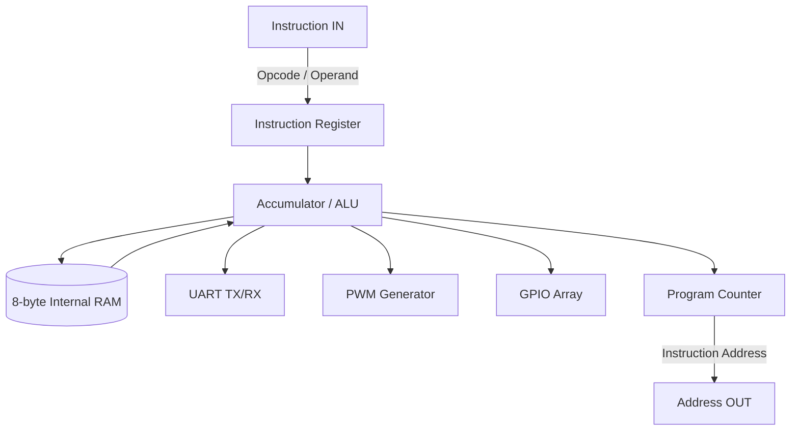

<div align="center">

# TinySoC : 8-bit Microcontroller

<p align="center">
  
  
  
  
  
  
  
</p>

An ultra-compact 8-bit Harvard Architecture microcontroller designed specifically for the Tiny Tapeout platform. Built for extreme efficiency, it packs a Turing-complete CPU, SRAM, fully dynamic UART, PWM, and GPIO into a single 1x1 IHP SG13G2 tile.

</div>

<br>

## Table of Contents
1. [Silicon Specifications](#silicon-specifications)
2. [Architecture Overview](#architecture-overview)
3. [Memory Map](#memory-map)
4. [Instruction Set Architecture (ISA)](#instruction-set-architecture-isa)
5. [Peripherals in Detail](#peripherals-in-detail)
6. [Pin Configuration](#pin-configuration)
7. [Software Toolchain](#software-toolchain)
8. [Verification Methodology](#verification-methodology)

---

## Silicon Specifications

TinySoC is designed to maximize computational density within a constrained 1x1 tile footprint on the IHP SG13G2 130nm BiCMOS node. 

* **Target Density:** 0.88 (PPA optimized with down-counter architecture for maximum routing space).
* **Operating Frequency:** 50 MHz native simulation (Dynamically adaptable to system clock).
* **Bus Architecture:** 8-bit internal data bus, 8-bit multiplexed external instruction fetch.

---

## Architecture Overview

TinySoC operates on a highly deterministic, 3-stage finite state machine pipeline. The design deliberately eschews a complex multi-cycle data path in favor of a rigid, predictable execution flow.

### Pipeline Stages
1. **FETCH (State 0):** The Program Counter (PC) is driven to the `uo_out` pins. The external memory returns the 8-bit instruction opcode to the `ui_in` bus. The opcode is latched into the internal Instruction Register (IR), and the PC increments.
2. **FETCH_OP (State 1):** The PC is driven again to fetch the subsequent 8-bit operand (if required by the opcode). The operand is latched, and the PC increments.
3. **EXECUTE (State 2):** The ALU performs the requested computation. Register write-backs, peripheral interactions, and memory mapping occur synchronously.



---

## Memory Map

The microcontroller uses strict Memory-Mapped I/O to communicate with peripherals. The ALU only natively interacts with the Accumulator. All other states are handled by loading and storing to specific addresses.

| Address | Peripheral | Type | Description |
|---|---|---|---|
| `0x00 - 0x07` | **Internal RAM** | R/W | 8 bytes of internal flip-flop based scratchpad RAM. |
| `0x20` | **GPIO Data** | R/W | Reading fetches input state. Writing sets output state. |
| `0x21` | **GPIO Direction** | R/W | 1 configures the corresponding pin as Output, 0 as Input. |
| `0x22` | **Hardware Timer** | R/W | Free-running 8-bit hardware timer. Writing any value resets it to 0. |
| `0x23` | **UART RX Data** | R | Reading automatically pops the data and clears the RX ready flag. |
| `0x24` | **UART TX Data** | W | Writing an 8-bit character triggers serial transmission instantly. |
| `0x25` | **UART Status** | R | Bit 0: RX Ready, Bit 1: TX Busy. |
| `0x26` | **PWM Duty** | R/W | 8-bit duty cycle compare threshold. |
| `0x28` | **BAUD_DIV_L** | R/W | 16-bit UART clock divider (Low Byte). |
| `0x29` | **BAUD_DIV_H** | R/W | 16-bit UART clock divider (High Byte). |

*Note: Accessing unmapped addresses acts as a hardware `NOP`.*

---

## Instruction Set Architecture (ISA)

TinySoC utilizes a custom, heavily optimized 16-bit instruction set. Every valid instruction consists of an 8-bit Opcode followed by an 8-bit Operand.

| Opcode | Mnemonic | Description | Flags Affected |
|--------|----------|-------------|----------------|
| `0x01` | `LDI val` | Load Immediate `val` into Accumulator (ACC) | Z |
| `0x02` | `LDR addr` | Load ACC from Memory Address `addr` | Z |
| `0x03` | `STR addr` | Store ACC to Memory Address `addr` | None |
| `0x04` | `ADD addr` | Add memory at `addr` to ACC | Z, C |
| `0x05` | `SUB addr` | Subtract memory at `addr` from ACC | Z, C |
| `0x06` | `JMP addr` | Jump unconditionally to `addr` | None |
| `0x07` | `JZ addr` | Jump to `addr` if Zero Flag (Z) is 1 | None |
| `0x08` | `AND addr` | Bitwise AND memory at `addr` with ACC | Z |
| `0x09` | `OR addr`  | Bitwise OR memory at `addr` with ACC | Z |
| `0x0A` | `XOR addr` | Bitwise XOR memory at `addr` with ACC | Z |
| `0x0B` | `SHL addr` | Logical Shift Left ACC by memory at `addr` | Z |
| `0x0C` | `SHR addr` | Logical Shift Right ACC by memory at `addr` | Z |
| `0x0D` | `CALL addr`| Push return address (current PC) and Jump to `addr` | None |
| `0x0E` | `RET` | Return from subroutine (Pop address to PC) | None |
| `0x0F` | `JNZ addr` | Jump to `addr` if Zero Flag (Z) is 0 | None |
| `0x10` | `JC addr` | Jump to `addr` if Carry Flag (C) is 1 | None |
| `0xFF` | `NOP` | No Operation | None |

### Flag Behaviors
* **Z (Zero Flag):** Set to 1 if the result of an arithmetic, logical, or load operation is exactly `0x00`.
* **C (Carry Flag):** Set to 1 if an `ADD` operation overflows beyond 255, or if a `SUB` operation requires a borrow.

---

## Peripherals in Detail

### 1. Dynamic UART
TinySoC features a fully dynamic, software-configurable UART transceiver. By utilizing a 16-bit fractional divider spanning `0x28` (Low Byte) and `0x29` (High Byte), the core can adapt to any arbitrary external clock speed.

The baud rate formula is: `Divider = Clock_Frequency / Target_Baud_Rate`

For example, to achieve a 115200 baud rate on a 50 MHz system clock, the divider is `434` (`0x01B2`). The firmware simply writes `0xB2` to `0x28` and `0x01` to `0x29`. The hardware architecture employs an ultra-efficient zero-check down-counter rather than a massive magnitude comparator, guaranteeing that mid-transmission baud rate changes will not lock up the finite state machine.

### 2. Pulse Width Modulation (PWM)
The 8-bit PWM generator provides a background continuous waveform on `uio[7]`. By writing a value from `0x00` to `0xFF` to `0x26`, the duty cycle can be precisely controlled from 0% to 100%. The PWM counter runs asynchronously from the CPU state machine, meaning it requires zero CPU overhead to maintain the waveform.

### 3. General Purpose I/O (GPIO)
Pins `uio[4:0]` are fully bidirectional. The data direction register at `0x21` controls the tristate buffers. Setting a bit to `1` enables the output driver. Setting it to `0` sets the pin to a high-impedance input state, which can be sampled by reading `0x20`.

---

## Pin Configuration

Physical Tiny Tapeout pins mapped via `info.yaml`:

| Group | Pin | Function | Description |
|---|---|---|---|
| **Input** | `ui[7:0]` | Instruction Input | The raw 8-bit instruction opcode/operand fetched from external memory. |
| **Output** | `uo[7:0]` | Address Output | The Program Counter driving the external memory address. |
| **Bidirectional** | `uio[4:0]` | GPIO Pins | General Purpose I/O pins, direction controlled via register `0x21`. |
| **Bidirectional** | `uio[5]` | UART TX | Serial transmit line (Output). |
| **Bidirectional** | `uio[6]` | UART RX | Serial receive line (Input). |
| **Bidirectional** | `uio[7]` | PWM OUT | Pulse Width Modulation output signal. |

---

## Software Toolchain

A custom Python assembler is provided in the `software/` directory. It converts mnemonic assembly language into raw machine code (hex arrays) compatible with standard ROM emulators (such as the RP2040 on the Tiny Tapeout demo board).

### Assembler Usage
```bash
python3 software/assembler.py software/demo.asm
```
This generates an output file containing the compiled bytes ready for flashed memory. The assembler resolves custom labels, relative jumps, and macro expansions.

---

## Verification Methodology

This repository enforces an aggressive, multi-faceted verification methodology to guarantee silicon reliability. The test harness relies on **Verilator** and **Cocotb** for cycle-accurate simulation.

### Test Coverage
* **ISA Verification:** Exhaustive regression tests validating every opcode combination, branching logic, and ALU flag generation.
* **Peripheral Verification:** Granular validation of the dynamic UART baud generation, glitch immunity on the RX line, and PWM edge alignments.
* **SoC Integration Test:** A complete C++ firmware testbench (`sim_main.cpp`) runs compiled assembly directly on the Verilated core, achieving 100% valid line coverage across the functional memory map.

Run the test suite locally using the included Makefiles:
```bash
cd test
make all
```
